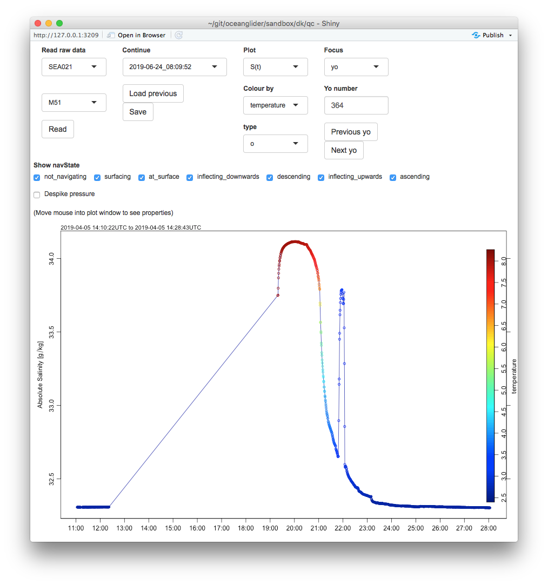

# An example spike

The two plots show the `qc02.R` app, for an $S$ profile (yo 364) and
time-series. I have things set up so a status line indicates the data point
nearest the mouse, and using this on the second plot, I inferred that the event
lasted from about 14:21:47 to 14:22:05.  (My graph calls this UTC, but I've not
actually checked to know whether I'm right on guessing that BIO uses UTC for
these.)

Although I'm not including diagrams, I see that yo 820 is also wonky, from time
05:03:18 to 05:03:38, i.e. for 20 seconds.

Since I'm getting these times just by moving the mouse around, I can be off by
a few seconds.  However, it seems noteworthy that both events are of roughly
equal duration.

Perhaps this duration will mean something, to someone who knows how the CTD
pump works, and who knows about the time-averaging setup with the software.
(What happens if a jellyfish gets sucked into this vacuum cleaner?)





# Algorithm for spike detection

I devised a criterion that might be good for revealing these spikes and also
the density inversions that can result from powering-on during an ascent, which
averages in salinities from the previous near-surface sampling, thus spuriously
reducing the inferred salinity in the deep water.

The method is simply to compute $N^2$.  I apply a running linear regression to
smooth the density signal. Also, it's necessary to order, and then reorder, the
data by pressure, for the running linear regression to work.

The whole code is below, along with the output.
```{r}
library(oceglider)

N2criterion <- 0.005
trialSpikeDetection <- FALSE

## Cache data
if (file.exists("odd_yos.rda")) {
    load("odd_yos.rda")
} else {
    load("../../sea021m51_20190729_1125.rda") # read and saved (i.e. all data)
    yo364 <- subset(g, yoNumber==364)
    yo711 <- subset(g, yoNumber==711)
    yo804 <- subset(g, yoNumber==804)
    yo820 <- subset(g, yoNumber==820)
    save(yo364, yo711, yo804, yo820, file="odd_yos.rda")
}

N2function <- function(pressure, sigma0, g=9.8, L=1, plot=FALSE) {
    rho0 <- 1000 + mean(sigma0, na.rm=TRUE)
    z <- swZ(pressure)
    o <- order(z)
    oo <- order(o)
    if (L > 0) {
        m <- runlm(z[o], sigma0[o], L=L)
        if (plot) plot(sigma0, z)
        sigma0 <- m$y[o]
        z <- m$x[o]
        if (plot) lines(sigma0[oo], z[oo], col=2)
        rval <- -g / rho0 * m$dydx
    } else {
        rval <- -g / rho0 * diff(sigma0)/diff(z)
        rval <- c(rval[1], rval)
    }
    rval[!is.finite(rval)] <- NA
    rval[oo]
}

spikeDetection1 <- function(p, x, sep=50, criterion=FALSE) {
    n <- length(p)
    inspike <- rep(NA, n)
    look <- diff(p) < 0
    look <- 1:n
    xx <- x[look]
    pp <- p[look]
    n <- length(pp)
    if (is.logical(criterion) && criterion) {
        for (i in seq(sep+1, n-sep-1))
            inspike[i] <- abs(xx[i] - 0.5*(xx[i-sep]+xx[i+sep])) > criterion
    } else {
        for (i in seq(sep+1, n-sep-1))
            inspike[i] <- (xx[i] - 0.5*(xx[i-sep]+xx[i+sep]))
    }
    inspike
}

spikeDetection2 <- function(p, x, L=5, criterion=FALSE) {
    o <- order(p)
    po <- p[o]
    xo <- x[o]
    m <- runlm(x=po, y=xo, L=L)
    if (is.logical(criterion) && criterion) {
        inspike <- abs(xo - m$y) > criterion
    } else {
        inspike <- xo - m$y
    }
    inspike[order(o)]
}


for (yo in c(yo364, yo711, yo804, yo820)) {
## for (yo in c(yo364)) {
    t <- yo[["time"]]
    p <- yo[["pressure"]]
    CT <- yo[["CT"]]
    SA <- yo[["SA"]]
    z <- swZ(p)
    g <- 9.8
    sigma0 <- yo[["sigma0"]]
    spice0 <- yo[["spice0"]]
    N2 <- N2function(p, sigma0)
    mean(N2,na.rm=TRUE)
    sd(N2,na.rm=TRUE)
    par(mfrow=c(1, if (trialSpikeDetection) 3 else 2))
    par(mar=c(3, 3, 2, 1), mgp=c(2, 0.7, 0))
    ylim <- rev(range(p, na.rm=TRUE))
    plot(sigma0, p, type='p', ylim=ylim, pch=20, cex=0.5)
    grid()
    mtext(sprintf("yo=%d, mean N2=%.2e", yo[["yoNumber"]][1], mean(N2,na.rm=TRUE)), side=3)
    plot(N2, p, type='p', ylim=ylim, pch=20, cex=0.5)
    grid()
    abline(v=0, col='blue')
    ## Global criterion
    N2high <- N2 >= N2criterion
    N2low <- N2 <= -N2criterion
    points(N2[N2high], p[N2high], col="forestgreen", pch=20, cex=1.4)
    points(N2[N2low], p[N2low], col="red", pch=20, cex=1.4)
    ## Local criterion
    N2high <- N2 >= mean(N2,na.rm=TRUE)+3*sd(N2,na.rm=TRUE)
    N2low <- N2 <= mean(N2,na.rm=TRUE)-3*sd(N2,na.rm=TRUE)
    points(N2[N2high], p[N2high], col="forestgreen", pch=20, cex=1.2)
    points(N2[N2low], p[N2low], col="red", pch=20, cex=1.2)
    abline(v=mean(N2, na.rm=TRUE)+c(-3,3)*sd(N2, na.rm=TRUE),
           col=c("red","forestgreen"), lty='dashed')
    abline(v=N2criterion*c(-1,1), col=c("red","forestgreen"))
    mtext("dash=yo-based N2 criterion; solid=fixed", adj=0, cex=0.8)
    if (trialSpikeDetection) {
        sepTime <- 20 # seconds
        sep <- sepTime / median(diff(as.numeric(t)))
        inspike1 <- spikeDetection1(p, SA, sep=sep)
        plot(inspike1, p, ylim=rev(range(p)), type='p', pch=20, cex=1/2)
        inspike2 <- spikeDetection2(p, SA)
        lines(inspike2, p, col=2)
    }
}
```

