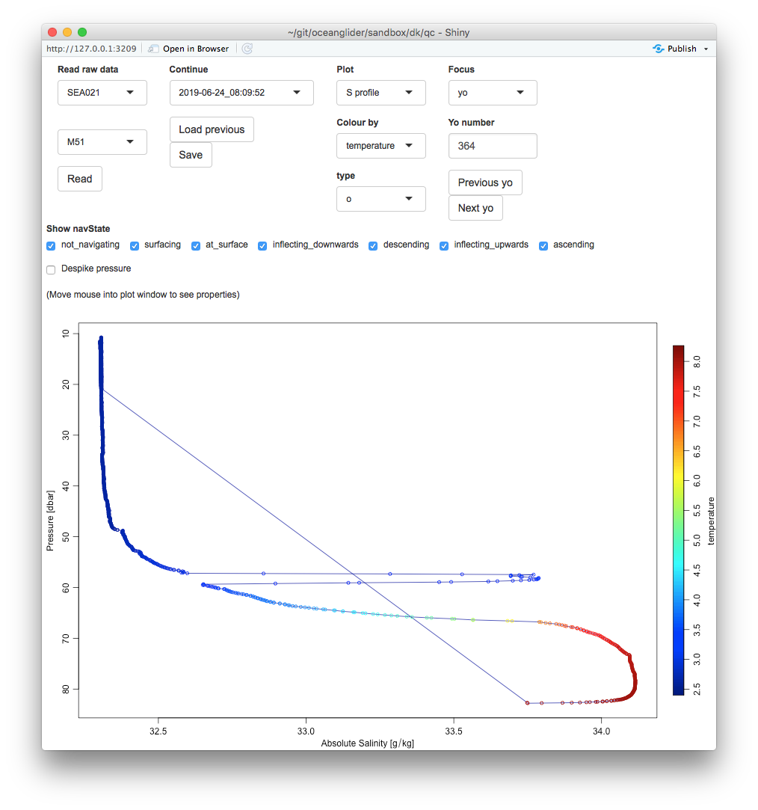

The two plots show the `qc02.R` app, for an $S$ profile and time-series. I have
things set up so a status line indicates the data point nearest the mouse, and
using this on the second plot, I inferred that the event lasted from about
14:21:47 to 14:22:05.  (My graph calls this UTC, but I've not actually checked
to know whether I'm right on guessing that BIO uses UTC for these.)

Although I'm not including diagrams, I see that yo 820 is also wonky, from time
05:03:18 to 05:03:38, i.e. for 20 seconds.

Since I'm getting these times just by moving the mouse around, I can be off by
a few seconds.  However, it seems noteworthy that both events are of roughly
equal duration.

Perhaps this duration will mean something, to someone who knows how the CTD
pump works, and who knows about the time-averaging setup with the software.
(What happens if a jellyfish gets sucked into this vacuum cleaner?)

