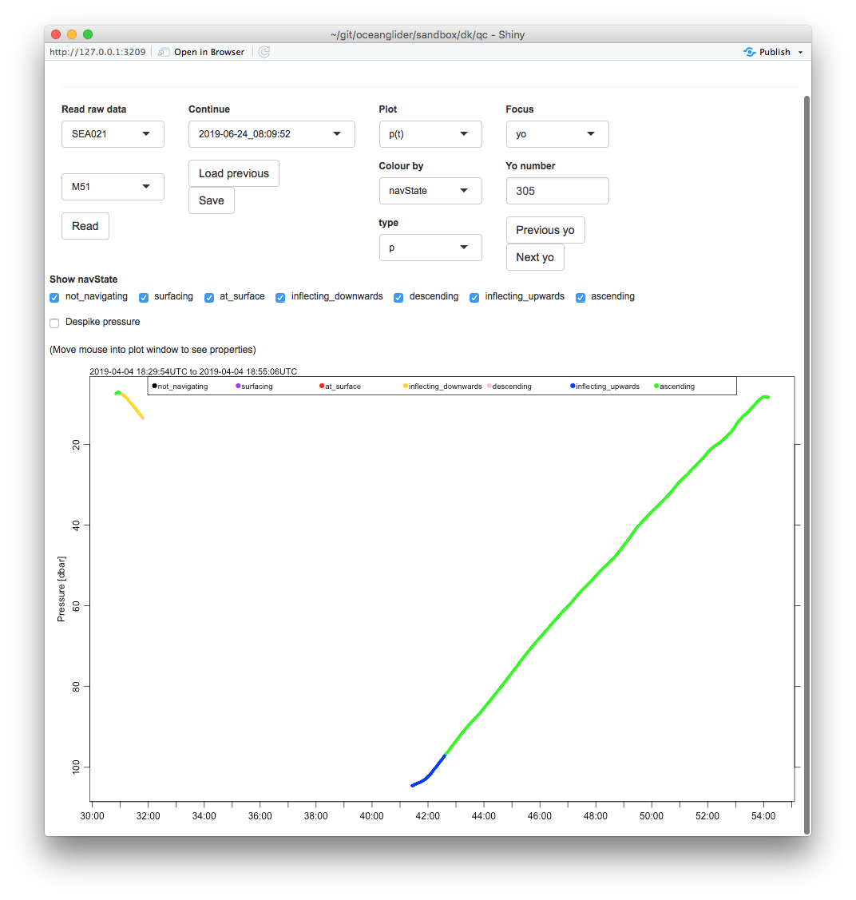
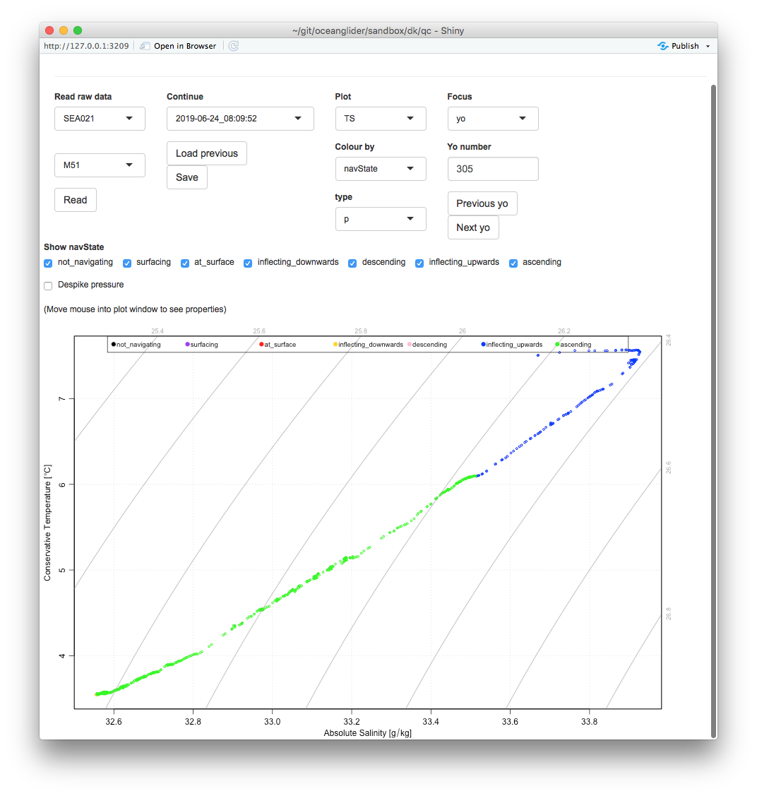
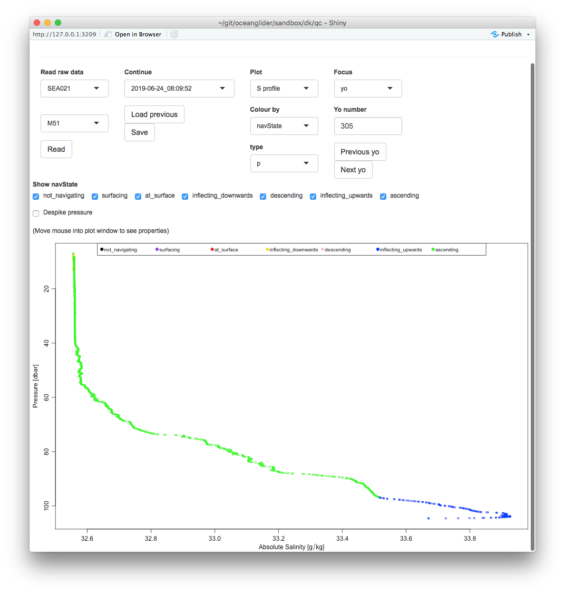

Clark, don't shoot me for being stupid, but I'm adding some new things to my QC
app, and wanted to double-check something on power on/off status.

I've included some figs from qc02.R, which I'll be using to try to find the
strong S spikes that Dave found in g21m51.  But that's not my question, really.

What I want to know is whether I am right in thinking that power to the CTD was
turned off at about minute 31 of this "yo", with power coming back on halfway
through minute 41?

The diagrams show yo 305 in three views. I'm sorry for the small fonts on the
colour-coding legend, which I will clean up and put outside the plot later on.

Color coding by navstate (sorry for small font on that)

