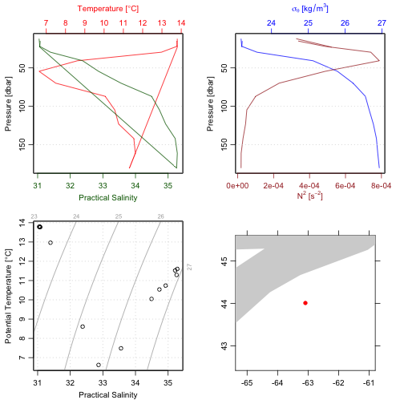
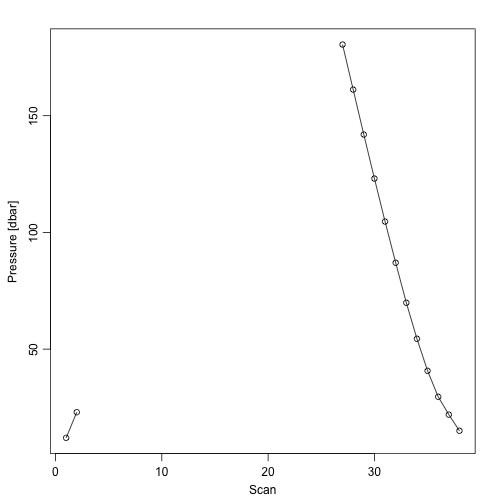
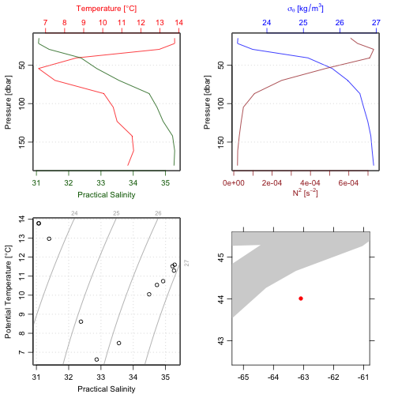

<!-- HOW TO BUILD THE VIGNETTE. -->
<!-- 1. edit this file in vignettes/oceanglider.Rmd -->
<!-- 2. devtools::build_vignettes() -->
<!-- 3. devtools::install(build_vignettes=TRUE) -->


**Abstract.** This vignette explains the basics of using the oceanglider
package on Seaexplorer and Slocum data. It is \emph{very much} a work in
progress, because the functions provided by this package are still much under
development.

# Introduction

The first step in working with glider data is normally to download them from a
server, and the lack of URL conventions for such servers makes this a
challenging task. The `download.glider()` function is provided to download
glider files from a server, caching the files locally to speed processing.
Using this function demands an understanding of the dataset naming convention
and the server file structure; see the individual examples below, but be aware
that they are only known to work for a few individual datasets.

# SeaExplorer Gliders

NOTE: The data used in the following are private. The URL structure in the
following example is subject to change without notice.

The portion `SEA024` indicates that this is the glider named 24, and the `M25`
portion refers to the 25-th mission. The pattern, the second argument The
`pld1` in the file pattern requests data from the science stream, the `.2.`
portion indicates that data from the the second descent/ascent sequence (or
'yo') is sought.


```r
library(oceanglider)
## url <- "ftp://ftp.dfo-mpo.gc.ca/glider/realData/SEA024/M32"
## filenames <- download.glider(url, "\\.200\\.gz$")
files <- system.file("extdata/seaexplorer/realtime",
                     c("sea024.32.gli.sub.200.gz",
                       "sea024.32.pld1.sub.200.gz"), package="oceanglider")
g <- read.glider.seaexplorer.realtime(files)
```

In applying this example to other situations, it might be helpful to write a
function for generating URLS, e.g. perhaps

```r
urlBIO <- function(glider="024", mission=32)
    paste("ftp://ftp.dfo-mpo.gc.ca/glider/realData/", glider, "/M", mission, sep="")
patternBIO <- function(yo=2)
    paste("\\.", yo, "\\.gz$", sep="")
```
where in \code{patternBIO()} using \code{type="pld1"} will yield the 'science'
data, and \code{type="gli"}  will yield the navigation data. (The distinction
between these two types is best explained elsewhere.)

Now, we could get the engineering data for this yo with

```r
filenames <- download.glider(urlBIO("SEA024", 32), patternBIO(200), debug=1)
g <- read.glider.seaexplorer.realtime(filenames)
```
(which is not executed here, owing to server accessibility).

Once we have the data, it can be useful to examine the `glider` and `payload`
components, e.g. with

```r
head(g[["glider"]], 3)
#>             Timestamp NavState SecurityLevel Heading Pitch  Roll Depth
#> 1 18/10/2018 16:39:55      117             0  137.98 15.57  1.85   9.7
#> 2 18/10/2018 16:40:05      110             0  131.71 19.33 -4.19   8.9
#> 3 18/10/2018 16:40:15      110             0  142.00 -6.82  1.48   8.5
#>   Temperature    Pa      Lat       Lon DesiredH BallastCmd BallastPos
#> 1        12.0 76181 4400.632 -6305.296      132        325        331
#> 2        12.0 76186 4400.632 -6305.296      132       -375         51
#> 3        12.1 76917 4400.632 -6305.296      132       -375       -331
#>   LinCmd LinPos AngCmd AngPos Voltage Altitude  X
#> 1     49     49    -13    -13      28       -1 NA
#> 2     68     68      0      0      28       -1 NA
#> 3     68     68      0      1      28       -1 NA
head(g[["payload"]], 3)
#>         PLD_REALTIMECLOCK NAV_RESOURCE longitude latitude NAV_DEPTH
#> 1 18/10/2018 16:40:34.419          110 -63.08827 44.01053     9.437
#> 2 18/10/2018 16:41:34.426          100 -63.08827 44.01053    25.410
#> 3 18/10/2018 16:42:34.435          100 -63.08827 44.01053    37.988
#>   FLBBCD_CHL_COUNT FLBBCD_CHL_SCALED FLBBCD_BB_700_COUNT
#> 1              123            0.9028                 138
#> 2              126            0.9394                 139
#> 3               NA                NA                  NA
#>   FLBBCD_BB_700_SCALED FLBBCD_CDOM_COUNT FLBBCD_CDOM_SCALED conductivity
#> 1           0.00024206                59             1.3590      3.74842
#> 2           0.00024472                56             1.0872      3.75204
#> 3                   NA                NA                 NA           NA
#>   temperature pressure GPCTD_DOF  X                time salinity
#> 1     13.7941    11.98   3915.41 NA 2018-10-18 16:40:34 31.04346
#> 2     13.7971    22.99   3922.44 NA 2018-10-18 16:41:34 31.07021
#> 3          NA       NA        NA NA 2018-10-18 16:42:34       NA
```

The payload is the preferred data source (consult `help("[[,glider-method")`
for the details of how `[[` works for `glider` objects), so we can make a CTD
object and plot it, before and after trimming to the upcast.

```r
library(oce)
ctd <- as.ctd(g[["salinity"]], g[["temperature"]], g[["pressure"]],
              longitude=g[["longitude"]], latitude=g[["latitude"]])
summary(ctd)
#> CTD Summary
#> -----------
#> 
#> * Mean location:       44.011N  63.088W 
#> * Data
#> 
#>                              Min.    Mean    Max.    Dim. OriginalName
#>     scan                     1       19.5    38      38   -           
#>     salinity [PSS-78]        31.043  33.169  35.282  38   -           
#>     temperature [°C, ITS-90] 6.6256  11.191  13.797  38   -           
#>     pressure [dbar]          11.98   76.061  180.49  38   -           
#>     latitude                 44.011  44.011  44.011  38   -           
#>     longitude                -63.088 -63.088 -63.088 38   -           
#> 
#> * Processing Log
#>     - 2019-04-12 11:11:46 UTC: `create 'ctd' object`
oce::plot(ctd)
#> Warning: CTD plots will have better coastlines after doing
#> install.packages("ocedata")
```



Note that there seems to be a retracing in the diagrams. To see why, use

```r
plotScan(ctd, type="o")
```


which tells us that there is a stray point from a surface interval. We *should* be
able to isolate the upcast by keying on `g[["NAV_RESOURCE"]]==100` but that does not
work, because of this stray point. But, as a stopgap measure, we can use `ctdTrim()` to
get better results:

```r
oce::plot(ctdTrim(ctd, "upcast"))
#> Warning: CTD plots will have better coastlines after doing
#> install.packages("ocedata")
```




# Slocum gliders
