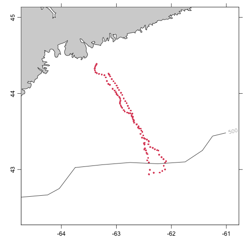

```{r, echo = FALSE}
knitr::opts_chunk$set(collapse = TRUE, comment = "#>")
```

**Abstract.** This vignette explains the basics of using the oceanglider package
on Slocum data. It is \emph{very much} a work in progress, because the functions
provided by this package are under active development.

# Non-netcdf files

This section has yet to been written.

# Netcdf files

A good first step in working with a glider file is to find the names of the
variables, as follows.

```{r eval=FALSE}
library(oceanglider)
file <- "~/data/gass/sbloom2023/batray-2023-03-17-delayed_trajectory_file.nc"
names <- read.glider.slocum.netcdf(file, nameMap="?")
```
This yields 144 character values, many of which are quite similar.  For example, it
might make sense that there only be one variable for latitude, but we find
```{r eval=FALSE}
names[grep("lat", names)]
```
yields
```{r eval=FALSE}
[1] "lat"                     "lat_uv"
[3] "profile_lat"             "platform"
[5] "lat_qc"                  "glider_record/c_wpt_lat"
[7] "glider_record/m_gps_lat" "glider_record/m_lat"
```
of these, clearly the fourth is not related to latitude, but the others seem to be.
After inspection of this particular file, the best choice seemed to be
`"glider_record/m_gps_lat"`, and so this is why the default `nameMap` for
`read.glider.slocum.netcdf() sets `latitude="glider_record/m_gps_lat"`.

Similar study, and a fair bit of testing and discussion, led to hypotheses for
other data items that ought to be a primary focus, and this is how the default
`nameMap` value was devised.

Continuing along this line of reasoning, we may extract location data and make
a simple plot with the following, producing Figure 1.
```{r eval=FALSE}
lon <- g[["longitude"]]
lat <- g[["latitude"]]
data("coastlineWorldFine", package="ocedata")
plot(coastlineWorldFine, span=450,
    clatitude=mean(lat, na.rm=TRUE), clongitude=mean(lon, na.rm=TRUE))
points(lon, lat, cex=0.5, pch=20, col=2)
data(topoWorld)
contour(topoWorld[["longitude"]], topoWorld[["latitude"]],
    -topoWorld[["z"]], level=500, add=TRUE, labcex=0.9)
```

A hint at other things that might be explored is given by the output from
```{r eval=FALSE}
summary(g)
```
which is
```{r eval=FALSE}
Glider Summary
--------------

* Input file:
    ~/data/gass/sbloom2023/batray-2023-03-17-delayed_trajectory_file.nc
* Type:    slocum
* Time ranges from 2023-03-17 16:10:55.232 to 2023-04-05 17:36:13.112 with 1822877 samples and mean increment 0.9999643 s
* Data Overview:
                        Min.      Mean    Max.    Dim.                             OriginalName
    conductivity      26.555    33.818  40.192 1822877 glider_record/sci_rbrctd_conductivity_00
    CT               0.71915    6.8498  11.945 1822877                 conservative_temperature
    density [kg/m³]   1024.8    1026.4  1028.4 1822877                                  density
    id                     2    88.343     147 1822877                               profile_id
    latitude          42.935    43.703  44.387 1822877                  glider_record/m_gps_lat
    longitude        -63.396   -62.752 -62.096 1822877                  glider_record/m_gps_lon
    O2                121.47    260.14  350.11 1822877                     oxygen_concentration
    pressure         -0.2229     74.03  257.36 1822877  glider_record/sci_rbrctd_seapressure_00
    profileLat [°N]   42.936    43.769  44.387 1822877                              profile_lat
    profileLon [°E]  -63.395   -62.805 -62.098 1822877                              profile_lon
    SA                31.069     33.53  35.481 1822877                        absolute_salinity
    salinity          30.922    33.372  35.312 1822877     glider_record/sci_rbrctd_salinity_00
    temperature       0.7013    6.8473  11.979 1822877  glider_record/sci_rbrctd_temperature_00
    u [m/s]         -0.29098 -0.044992 0.19447 1822877                                        u
    v [m/s]         -0.26387 -0.012287 0.15855 1822877                                        v
    vx              -0.29347  -0.04552 0.19611 1822877                 glider_record/m_water_vx
    vxi             -0.29347 -0.047374 0.19611 1822877         glider_record/m_initial_water_vx
    vy              -0.26742 -0.012923 0.15966 1822877                 glider_record/m_water_vy
    vyi             -0.26742 -0.012613 0.15966 1822877         glider_record/m_initial_water_vy

* Processing Log

    - 2023-07-13 12:07:18.668 UTC: `create 'glider' object`
```

# Figures




